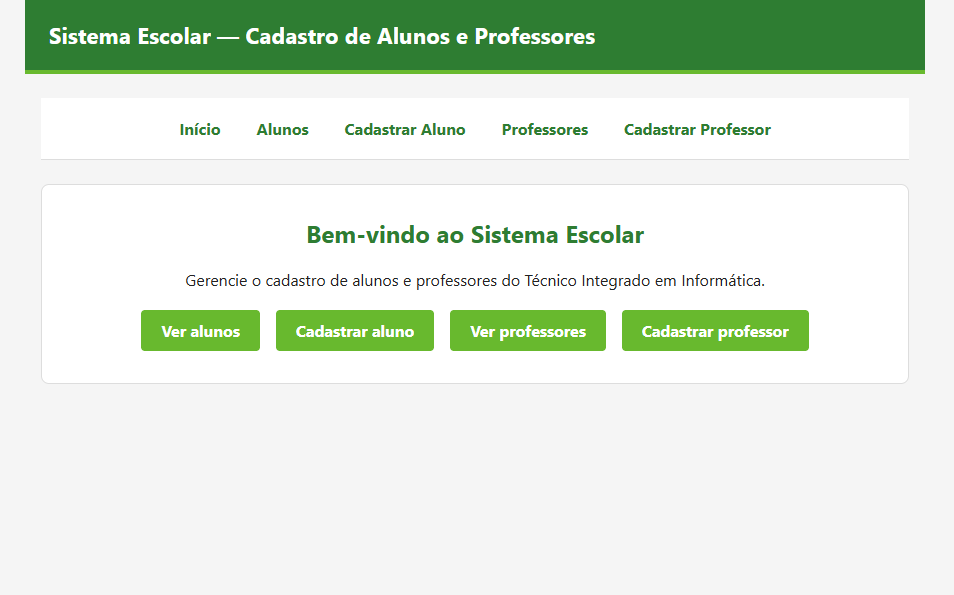

# ✦ Sistema Escolar ✦

Sistema desenvolvido para a disciplina de **Programação para Internet**, utilizando **React**, **Vite** e **JSON Server**.

A aplicação permite o cadastro e gerenciamento de alunos e professores, utilizando componentes reutilizáveis, gerenciamento de estado e comunicação com uma API REST local.

---

## ✧ Tecnologias Utilizadas

- React
- JavaScript
- CSS
- Vite
- Axios
- JSON Server
- React Router DOM

---

## ✧ Screenshots

### Sistema Escolar


---

## ✧ Funcionalidades

- Cadastro e listagem de alunos
- Cadastro, listagem e exclusão de professores
- Formulários reutilizáveis
- Navegação entre páginas com React Router
- Gerenciamento de estado utilizando `useState`
- Carregamento dos dados utilizando `useEffect`
- Comunicação com a API utilizando Axios
- Armazenamento dos dados utilizando JSON Server
- Mensagem de erro para problemas de conexão com a API

---

## ✧ Estrutura do Projeto

```
src/
├── services/
│   ├── alunoService.js
│   └── professorService.js
├── components/
│   ├── BarraNavegacao.jsx
│   ├── CampoTexto.jsx
│   ├── CardAluno.jsx
│   ├── CardProfessor.jsx
│   ├── FormularioAluno.jsx
│   ├── FormularioProfessor.jsx
│   ├── ListaAlunos.jsx
│   ├── ListaProfessores.jsx
│   └── MensagemErro.jsx
├── pages/
│   ├── PaginaInicial.jsx
│   ├── PaginaListagem.jsx
│   ├── PaginaCadastro.jsx
│   ├── PaginaListagemProfessores.jsx
│   └── PaginaCadastroProfessor.jsx
├── App.jsx
└── App.css

db.json
```

---

## ✧ API

O projeto utiliza o **JSON Server** para disponibilizar os dados localmente.

### Alunos

| Método | Endpoint  | Descrição            |
|--------|-----------|----------------------|
| GET    | `/alunos` | Lista os alunos      |
| POST   | `/alunos` | Cadastra um novo aluno |
| DELETE | `/alunos/:id`  | Exclui um aluno   |

### Professores

| Método | Endpoint            | Descrição                  |
|--------|---------------------|----------------------------|
| GET    | `/professores`      | Lista os professores       |
| POST   | `/professores`      | Cadastra um novo professor |
| DELETE | `/professores/:id`  | Exclui um professor        |

---

## ✧ Como Executar

### 1. Clone o repositório

```bash
git clone URL_DO_REPOSITORIO
```

### 2. Acesse a pasta do projeto

```bash
cd sistema-escolar-professores
```

### 3. Instale as dependências

```bash
npm install
```

### 4. Execute o JSON Server

Em um terminal:

```bash
npx json-server --watch db.json --port 3000
```

O JSON Server estará disponível em:

```
http://localhost:3000
```

### 5. Execute o projeto

Em outro terminal:

```bash
npm run dev
```

A aplicação estará disponível no endereço informado pelo Vite, geralmente:

```
http://localhost:5173
```

---

## ✧ Objetivo

Aplicar os conceitos de:

- Componentes
- Props
- Gerenciamento de estado
- `useState`
- `useEffect`
- React Router
- Axios
- API REST
- JSON Server

O projeto consiste no desenvolvimento de um sistema escolar para gerenciamento de alunos e professores.

---

## ✧ Instituição

**IFRN — Instituto Federal de Educação, Ciência e Tecnologia do Rio Grande do Norte**

Disciplina: **Programação para Internet**
